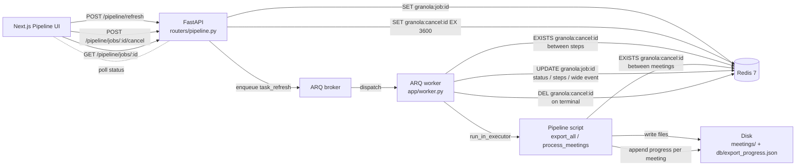
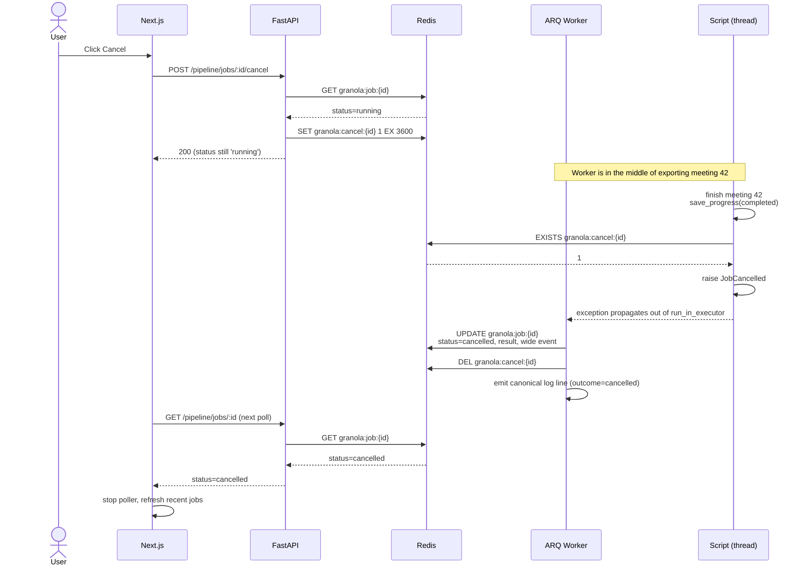
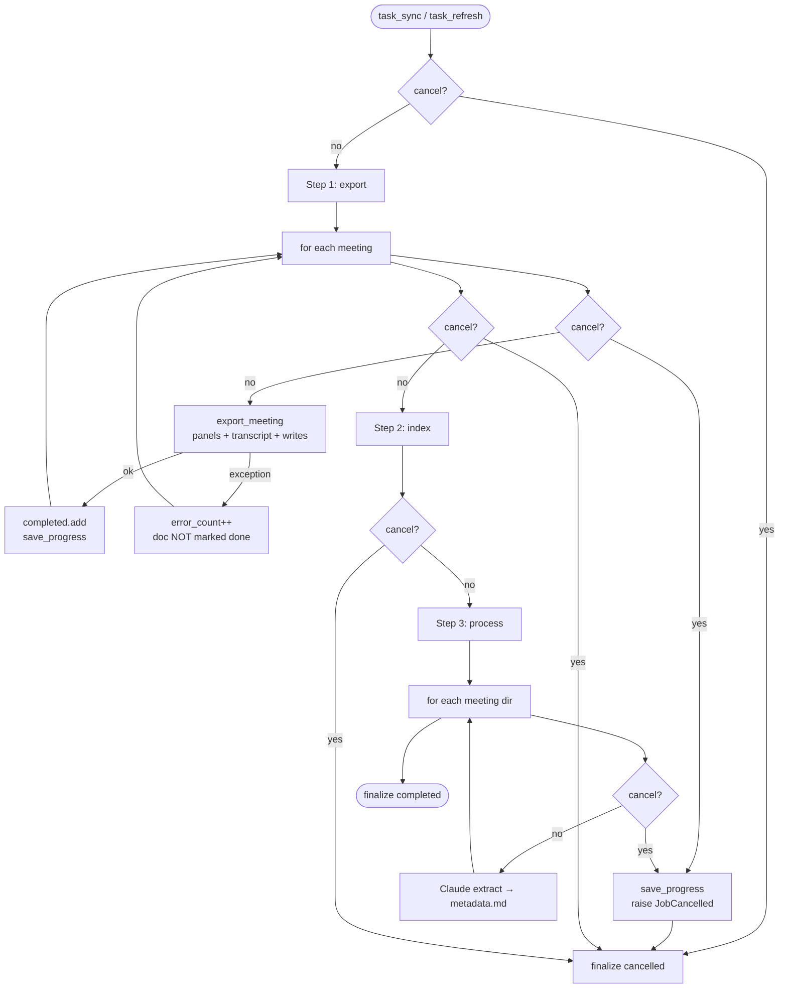
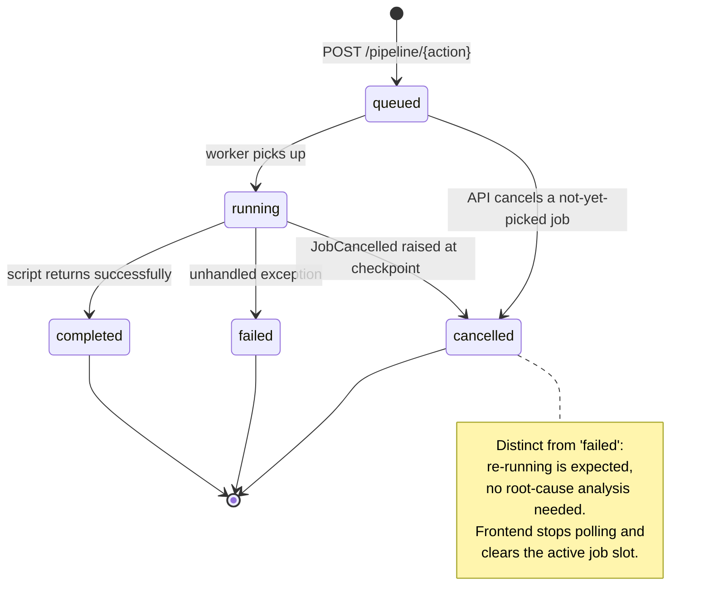

# Job Cancellation & Pipeline Idempotency

> Companion to `ctx-02-23-26-date-filtered-refresh-and-job-reconciliation.md`.
> That document set up the ARQ task model, custom `granola:job:{id}` tracking,
> and startup reconciliation. This document adds **cooperative cancellation**
> on top of that model and tightens **resume-state idempotency** in the
> long-running scripts.

## Problem

Two related issues exposed when our WorkOS token expired mid-pipeline:

1. **No way to stop a stuck or wrong-window job.** A job with a stale token
   loops on auth failures, or a user kicks off a 600-meeting refresh with
   the wrong date and has to wait for it to finish.
2. **Re-running a partially completed job did more work than necessary.**
   `export_progress.json` was saved every 10 meetings, so a kill at meeting
   7 re-fetched all 7 from the API on the next run. Worse, any run with
   `--since` (every `refresh` job) replaced the progress file with only
   the date-filtered slice, silently shrinking historical resume state.

The fix is the canonical Redis-queue pair: **cooperative cancellation
checkpoints** for stop-on-demand, and **per-unit-of-work checkpointing**
for safe resume.

## Why cooperative cancellation (not preemption)

ARQ exposes `abort_job(job_id)` that sends `asyncio.CancelledError` into
the running coroutine. Our pipeline does its work inside
`loop.run_in_executor(None, script_main)` — a synchronous thread. **asyncio
cannot cancel a Python thread.** `abort_job()` would either deadlock at
the executor join or silently no-op.

So we use the pattern Sidekiq, RQ, and Celery all converged on:

```
Producer (API)        →  SET granola:cancel:{job_id}  (TTL 3600s)
Consumer (worker)     →  EXISTS granola:cancel:{job_id}   ← polled at checkpoints
Consumer (worker)     →  raise JobCancelled  → finalize as status="cancelled"
Consumer (worker)     →  DEL granola:cancel:{job_id}
```

The work itself stops only when it reaches a checkpoint. That's a
deliberate trade-off: a meeting in flight finishes (3 HTTP calls, a few
seconds) so we never leave a half-fetched meeting on disk.

### Why a separate cancel key (not a status field)

We already write `granola:job:{id}` JSON on every status change. Why not
just set `status=cancelling` there?

| Reason | Detail |
|---|---|
| **Atomic check** | `EXISTS key` is one cheap O(1) call; reading + JSON-parsing the job blob on every loop iteration would burn CPU and risk torn reads against the worker's writes |
| **Decouples signal from observability** | The job blob is the consumer-facing projection; the cancel key is a control signal. Mixing them means every status update has to reason about the cancel field |
| **Auto-recovery via TTL** | A 3600s TTL on the cancel key means a worker that crashed before clearing the flag cannot poison the next reuse of the same job_id; the status blob has no equivalent |

## Architecture

### Component overview



Two control planes share Redis but never touch each other's data:

- **State plane**: `granola:job:{id}` (JSON job record), `granola:job:{id}:logs`
  (RPUSH list), `granola:recent_jobs` (recency list).
- **Control plane**: `granola:cancel:{id}` (cancel flag).

### Cancellation sequence



### Where the checkpoints live



Three layers of checkpoints, ordered from cheapest-to-honour to most-expensive:

1. **Between top-level steps** (`task_sync`, `task_refresh`): catches a cancel
   issued during, say, indexing — async check via `is_cancelled_async(redis, job_id)`.
2. **Between meetings** in `export_all` and `process_meetings`: sync check
   via `check_cancelled()` reading `GRANOLA_JOB_ID` from env.
3. **No mid-meeting cancellation**: a meeting in flight finishes (~2-5s).
   Doc-level idempotency makes that safe to keep — see below.

## Idempotency invariants

### What "done" means per pipeline stage

| Stage | Done marker | Re-run behaviour |
|---|---|---|
| `export_meeting(doc)` | `completed.add(doc.id)` runs only if the function returned True (no exception during the 3 file writes) | Doc appears in `remaining` again — re-fetched and overwritten. Overwrite is idempotent: same `granola_id` → same files |
| `build_index` | n/a — always full rebuild from `meetings/` | Always idempotent; SQLite FTS5 rebuilt from disk truth |
| `process_meetings` | `metadata.md` exists in the meeting dir | Skipped on next run unless `--reprocess`. Mid-Claude-call failure leaves no partial file — re-runs cleanly |

### Why `completed.add` only fires on success

`export_meeting` writes notes → summary → transcript inside one `try`. If
the transcript fetch raises, control jumps to the `except` block and the
function returns False. The caller never reaches `completed.add(doc.id)`.
Next run sees the doc as not-done, re-fetches everything, and overwrites
whichever files happened to be written first time. The progress file
never lies.

### The pre-existing bug we fixed

```python
# BEFORE: --since caused the file to be replaced with only the slice
skip_resume = args.no_resume or args.since or args.ids
completed = set() if skip_resume else load_progress()
...
save_progress(completed)  # overwrites with the date-filtered slice only
```

A `refresh --since 2026-05-01` would seed `completed = set()`, add the few
hundred matching docs as it exported them, then save_progress() would
write only those IDs back — wiping the historical record of every meeting
exported before May 1.

```python
# AFTER: always load, but bypass the "skip if already done" filter
completed = set() if args.no_resume else load_progress()
skip_filter = args.no_resume or args.since or args.ids
remaining = list(documents) if skip_filter else [d for d in documents if d.id not in completed]
...
save_progress(completed)  # merge-by-construction: completed already includes history
```

`completed` is now always the *union* of every meeting ever exported. The
`--since` flag forces re-export of the matching window (overwriting files
on disk) but never narrows the resume index.

### Per-meeting save granularity

Save cost is ~600 UUIDs × 36 bytes ≈ 22 KB JSON serialise + fsync, dwarfed
by the 3 HTTP calls already made for that meeting. Worst-case loss on
crash is now **zero confirmed exports** (was up to 9).

## Redis keyspace summary

| Key | Type | TTL | Set by | Read by |
|---|---|---|---|---|
| `granola:job:{id}` | JSON string | 86400s | API (create), worker (status updates) | API, frontend |
| `granola:job:{id}:logs` | List (RPUSH) | 86400s | worker `JobLogHandler` | API, frontend |
| `granola:recent_jobs` | List (LPUSH + LTRIM 50) | none | API on create | API (job list) |
| `granola:cancel:{id}` | String "1" | 3600s | API cancel endpoint | worker, script (sync redis) |
| `arq:queue` / `arq:result:{id}` | ARQ-internal | ARQ default | ARQ library | startup reconciliation |

The cancel key's short 3600s TTL is intentional: even if both the worker
crashes mid-cancel and the API never gets a chance to `DEL` it, the flag
self-clears within an hour — no manual cleanup, no risk of poisoning a
later job that happens to inherit the same `job_id` (UUIDs make collision
vanishingly unlikely, but TTL is the cheap belt-and-suspenders).

## Bridging async (worker) and sync (script)

Scripts run via `run_in_executor` — they're synchronous CPython code that
imports `requests` and writes files. They can't `await` an async Redis
client. Two patterns considered:

| Option | Verdict |
|---|---|
| Pass an `asyncio.Event` or `Future` into the script | Breaks the "scripts are runnable from CLI too" contract; requires every script to know it's being driven by a worker |
| Filesystem cancel sentinel (`db/.cancel/{job_id}`) | Adds a third moving part (file in addition to Redis flag); doesn't play well with the rest of our Redis-native control plane |
| **Sync redis-py client + env vars** ✅ | Scripts read `GRANOLA_JOB_ID` from env; if set, they spin up a sync redis client and check `granola:cancel:{id}`. If env is empty (plain CLI use), `check_cancelled()` is a no-op |

The worker sets `GRANOLA_JOB_ID` and `REDIS_URL` in `os.environ` before
invoking `script_main()`, and restores the previous values in `finally`.
This matters because the worker process is long-lived (`max_jobs=1` per
the existing config); a leaked env var from job A would let a stale flag
short-circuit job B.

## Status taxonomy



Adding `cancelled` as a first-class terminal status (not just `failed`
with a special result string) lets the UI badge it gray instead of red
and skips the "investigate this failure" mental tax.

## Operational notes

- **Re-running a cancelled job is the expected workflow.** Trigger the
  same action again; the export script will resume where it left off
  (from `db/export_progress.json`) and skip any meeting it already saw,
  unless a `--since`/`--ids` filter forces a re-fetch of that window.
- **Logs are preserved across cancellation.** `JobLogHandler` keeps
  appending to `granola:job:{id}:logs` up to the point the worker
  finalises the cancelled state. The UI's `LogViewer` renders them as
  terminal once the status flips.
- **A stuck job (worker dead, status still 'running')** is recovered by
  the existing startup reconciliation in `app/worker.py:on_startup`,
  which marks orphaned jobs as failed when ARQ already has a result for
  them. Cancellation does not change that path.
- **Multiple cancels are idempotent.** `SET key 1 EX 3600` is safe to
  call repeatedly. Re-cancelling a job already in a terminal state
  returns HTTP 409 (`Job is already cancelled; nothing to cancel`).

## Files touched

- `src/cancel.py` — new module exposing `JobCancelled`, `check_cancelled`
  (sync), `request_cancel_async` / `is_cancelled_async` / `clear_cancel_async`
  (async). Lazy imports `redis` so plain CLI usage doesn't require it.
- `src/config.py` — `CANCEL_KEY_PREFIX`, `CANCEL_TTL_SECONDS`.
- `scripts/export_all.py` — per-meeting `save_progress`; checkpoint at top
  of meeting loop; progress-file merge fix.
- `scripts/process_meetings.py` — checkpoint at top of meeting-dir loop.
- `web/backend/app/worker.py` — env-var bridge, `_raise_if_cancelled`
  between steps, `JobCancelled` handler that writes status=cancelled and
  clears the flag; consolidated single-script tasks behind
  `_run_script_task`.
- `web/backend/app/routers/pipeline.py` — `POST /pipeline/jobs/{id}/cancel`.
- `web/backend/app/schemas.py` — `JobStatus.cancelled`.
- `web/frontend/src/types/index.ts` — `cancelled` in `JobStatusType`.
- `web/frontend/src/components/JobStatusBadge.tsx` — gray badge style.
- `web/frontend/src/lib/api.ts` — `cancelJob(jobId)`.
- `web/frontend/src/hooks/useJobPoller.ts` — stop polling on `cancelled`.
- `web/frontend/src/app/pipeline/page.tsx` — Cancel button visible during
  queued/running, terminal-state predicate centralised.

## What this deliberately does not do

- **No mid-meeting interruption.** Cancelling during `export_meeting` for
  meeting 42 lets it finish. Adding finer-grained checkpoints inside the
  3 HTTP calls would require threading a cancel signal through
  `GranolaClient`, fighting `requests`' blocking I/O. Not worth the
  complexity for a 2–5s window.
- **No queue-wide cancel.** The endpoint cancels one job. Wiping the
  entire ARQ queue is a different operation (and a destructive one we
  haven't needed).
- **No retry policy change.** Cancelled jobs are terminal, not retried.
  The user re-triggers explicitly if they want another attempt.
