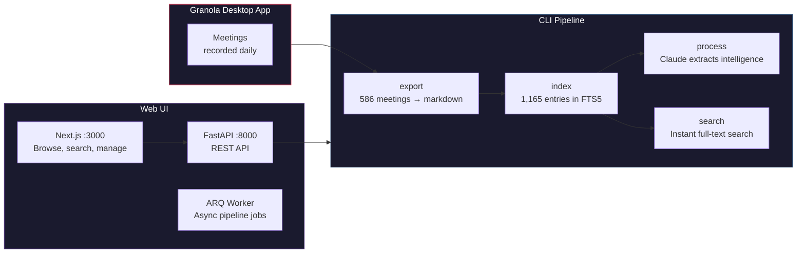
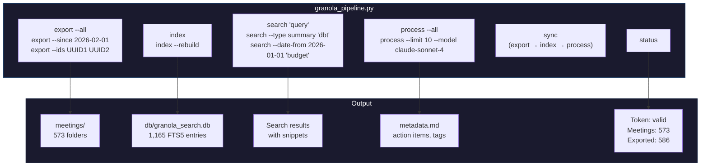
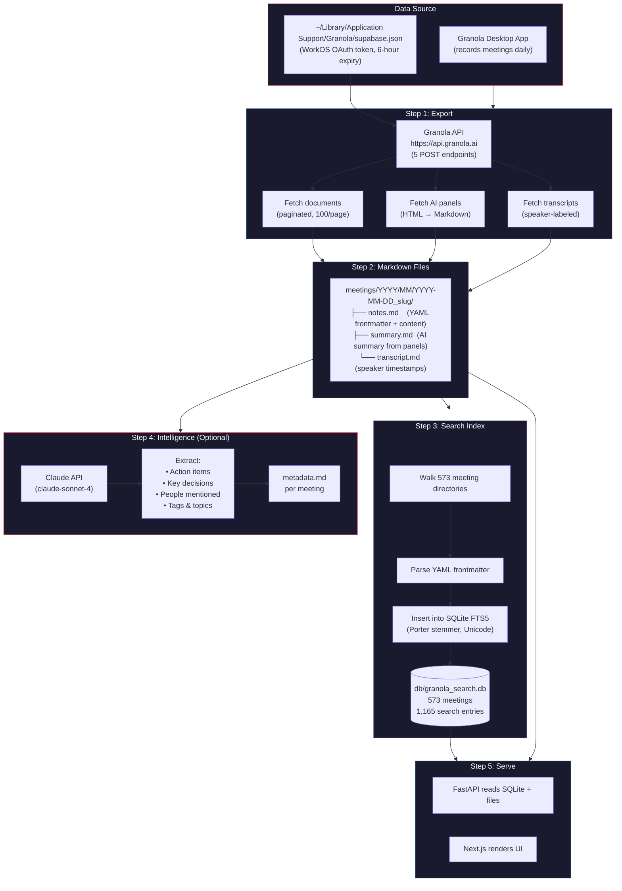

# Granola Meetings

Export, index, search, and analyze your Granola meeting data — via CLI or a full web UI.



---

## What This Project Does

1. **Exports** all your Granola meetings (notes, AI summaries, transcripts) to structured markdown files
2. **Indexes** everything into a SQLite FTS5 full-text search database
3. **Processes** meetings with Claude API to extract action items, decisions, tags, and topics
4. **Serves** a web UI to browse meetings, search content, and trigger pipeline jobs

All of this works with Granola's internal API — no MCP, no official SDK. The API was reverse-engineered from the desktop app.

---

## Quick Start

### Prerequisites

- Python 3.10+
- Node.js 18+
- Redis (for the web UI's async job queue)
- Granola desktop app running (provides the auth token)

### CLI Pipeline

```bash
# Install Python dependencies
pip install -r requirements.txt

# 1. Export all meetings to markdown
python granola_pipeline.py export --all

# 2. Build the search index
python granola_pipeline.py index

# 3. Search your meetings
python granola_pipeline.py search "Bank of America duplication"

# 4. Process with Claude (optional — requires ANTHROPIC_API_KEY)
python granola_pipeline.py process --all

# 5. Check status
python granola_pipeline.py status
```

### Web UI

```bash
# Terminal 1: Redis
redis-server

# Terminal 2: FastAPI backend
cd web/backend
pip install -r requirements.txt
uvicorn app.main:app --reload --port 8000

# Terminal 3: ARQ worker (for async pipeline jobs)
cd web/backend
arq app.worker.WorkerSettings

# Terminal 4: Next.js frontend
cd web/frontend
npm install
npm run dev
```

Open **http://localhost:3000**

---

## Project Structure

```
granola-meetings/
├── src/                           # Core Python library (reusable)
│   ├── config.py                  # Paths, API URLs, constants
│   ├── auth.py                    # Token loading & validation
│   ├── api_client.py              # Granola API wrapper (rate-limited)
│   ├── models.py                  # Dataclasses for API responses
│   ├── converters.py              # HTML/ProseMirror → Markdown
│   ├── search_db.py               # SQLite FTS5 index management
│   └── processor.py               # Claude API integration
│
├── scripts/                       # Executable pipeline scripts
│   ├── export_all.py              # Fetch meetings → markdown files
│   ├── build_index.py             # Index markdown → SQLite FTS5
│   ├── process_meetings.py        # Claude API → metadata.md
│   ├── build_knowledge_graph.py   # Entity extraction → graph
│   └── search.py                  # CLI search interface
│
├── web/                           # Full-stack web application
│   ├── backend/                   # FastAPI + ARQ
│   │   ├── app/
│   │   │   ├── main.py            # FastAPI app, CORS, lifespan
│   │   │   ├── schemas.py         # Pydantic request/response models
│   │   │   ├── dependencies.py    # Redis pool, SearchDB singleton
│   │   │   ├── worker.py          # ARQ tasks: export, index, process
│   │   │   └── routers/
│   │   │       ├── meetings.py    # GET /api/meetings, /api/meetings/{id}
│   │   │       ├── search.py      # GET /api/search?q=...
│   │   │       ├── pipeline.py    # POST /api/pipeline/{action}
│   │   │       └── status.py      # GET /api/status
│   │   └── requirements.txt
│   └── frontend/                  # Next.js + Tailwind CSS
│       └── src/
│           ├── app/               # Pages (dashboard, meetings, search, pipeline)
│           ├── components/        # MeetingCard, SearchBar, TranscriptViewer, etc.
│           ├── hooks/             # useJobPoller (poll job status every 2s)
│           ├── lib/api.ts         # Typed fetch wrappers
│           └── types/index.ts     # TypeScript interfaces
│
├── meetings/                      # Exported markdown (generated, gitignored)
│   └── YYYY/MM/YYYY-MM-DD_slug/
│       ├── notes.md               # User-written notes
│       ├── summary.md             # AI-generated summary
│       └── transcript.md          # Full conversation transcript
│
├── db/                            # SQLite database (generated, gitignored)
│   ├── granola_search.db          # FTS5 index (573 meetings, 1,165 entries)
│   └── export_progress.json       # Resume tracking for interrupted exports
│
├── .context/                      # Reverse-engineered API documentation
├── docs/                          # Architecture documentation
│   ├── how-index-works.md         # FTS5 indexing deep dive
│   ├── backend-architecture.md    # FastAPI + ARQ architecture
│   └── frontend-architecture.md   # Next.js + Tailwind architecture
│
├── granola_pipeline.py            # Main CLI entrypoint
└── requirements.txt               # Python dependencies
```

---

## The Three Interfaces

### 1. CLI Pipeline

The original interface. Run pipeline steps directly from the terminal.



**Real examples:**

```bash
# Export only meetings from the last week
python granola_pipeline.py export --since 2026-02-15

# Search for a specific topic across all content types
python granola_pipeline.py search "Bank of America duplication"
# → 19 results in <0.1s, ranked by relevance

# Search only in AI summaries (not raw transcripts)
python granola_pipeline.py search --type summary "dbt airflow"

# Search within a date range
python granola_pipeline.py search --date-from 2025-04-01 --date-to 2025-06-30 "interview"

# Process meetings with Claude to extract action items
python granola_pipeline.py process --since 2026-02-01 --model claude-sonnet-4-20250514

# Full pipeline in one command
python granola_pipeline.py sync
```

### 2. FastAPI Backend

REST API that wraps the CLI pipeline. Handles synchronous reads (search, list) directly and dispatches long-running writes (export, index, process) to the ARQ worker.

| Method | Endpoint | Description |
|--------|----------|-------------|
| GET | `/api/meetings?offset=0&limit=50` | Paginated meeting list with date filter |
| GET | `/api/meetings/{id}` | Full meeting content (notes + summary + transcript) |
| GET | `/api/search?q=...&type=...&date_from=...` | Full-text search with filters |
| GET | `/api/status` | Token validity, DB stats, export count |
| POST | `/api/pipeline/{action}` | Trigger async job (export/index/process/sync) |
| GET | `/api/pipeline/jobs` | List recent jobs |
| GET | `/api/pipeline/jobs/{id}` | Get job status |

**Real examples:**

```bash
# Health check
curl http://localhost:8000/api/status
# → {"token_valid": true, "token_remaining_seconds": 20794, "db_stats": {"meetings": 573, ...}}

# List 5 most recent meetings
curl "http://localhost:8000/api/meetings?limit=5"

# Get full meeting content
curl "http://localhost:8000/api/meetings/456bd11d-40e9-4be4-bf3d-d698cec0b40c"
# → {title, summary_content (1560 chars), transcript_content (13679 chars), ...}

# Search across all content
curl "http://localhost:8000/api/search?q=Bank+of+America"
# → 19 results with highlighted snippets

# Trigger a full sync (async)
curl -X POST http://localhost:8000/api/pipeline/sync
# → {"job_id": "abc-123", "status": "queued"}

# Poll job status
curl http://localhost:8000/api/pipeline/jobs/abc-123
# → {"status": "running"} ... → {"status": "completed", "result": "Full sync finished"}
```

### 3. Next.js Frontend

Web UI with 5 pages:

| Page | URL | What It Shows |
|------|-----|---------------|
| Dashboard | `/` | Stats (573 meetings, token status), quick links |
| Meetings | `/meetings` | Paginated grid of all meetings, date filters |
| Meeting Detail | `/meetings/[id]` | Tabbed view: Notes / Summary / Transcript |
| Search | `/search` | Full-text search with type and date filters |
| Pipeline | `/pipeline` | Trigger jobs, view status with live polling |

---

## How Data Flows Through the System



---

## Meeting File Format

Every meeting is stored as 1-3 markdown files with YAML frontmatter:

**`meetings/2026/02/2026-02-19_bank-of-america-metrics-duplication/summary.md`**

```yaml
---
granola_id: "456bd11d-40e9-4be4-bf3d-d698cec0b40c"
title: "Bank of America metrics duplication investigation with Alexis"
date: "2026-02-19"
type: "summary"
template: "meeting-summary-consolidated"
panel_id: "93a86523-6790-4f02-be54-02e94adfa92f"
---
# Summary: Bank of America metrics duplication investigation

### Bank of America Data Duplication Issue
- Duplicate metrics appearing in final tables vs source tables
- Attribution keys showing 2 conversions in final view, only 1 in source
...
```

**`transcript.md`** uses `**[HH:MM:SS] Speaker:**` format:

```markdown
**[00:00:12] Other:** So the Bank of America data, I'm seeing duplicates
**[00:00:18] You:** Which table are you looking at?
**[00:00:22] Other:** The final attribution table vs the sill table
```

---

## Search Capabilities

The FTS5 index supports:

| Feature | Example |
|---------|---------|
| Simple query | `Bank of America` |
| Phrase match | `"sprint planning"` |
| Boolean AND | `dbt AND airflow` |
| Boolean NOT | `Snowflake NOT migration` |
| Wildcard | `data*` (matches data, database, dataops) |
| Filter by type | `--type summary` (notes, summary, transcript) |
| Filter by date | `--date-from 2025-04-01 --date-to 2025-06-30` |
| Ranked results | Ordered by FTS5 relevance score |
| Highlighted snippets | `**matched**` words in 40-word context |

**Performance**: <0.01 seconds for any query across 1,165 indexed entries (vs ~3 seconds for `grep -r`).

---

## Authentication

The Granola desktop app stores a WorkOS OAuth token at:

```
~/Library/Application Support/Granola/supabase.json
```

The token expires every **6 hours**. When it expires:
1. Open the Granola desktop app (it auto-refreshes the token)
2. Check validity: `python granola_pipeline.py status`
3. Or check via API: `GET /api/status` → `token_valid: true/false`

The project reads this token file directly — no separate login flow needed as long as Granola is installed on the same machine.

---

## Architecture Decisions

| Decision | Why |
|----------|-----|
| Internal API over Granola MCP | MCP is AI-summarized (lossy). Internal API gives raw data with full pagination control |
| File-per-aspect (notes/summary/transcript) | Different use cases, selective processing, incremental updates |
| SQLite FTS5 over Elasticsearch | Zero-config, embedded, Porter stemming, no server dependency |
| Python for CLI, TypeScript for frontend | Python fits JSON/SQLite/API work; TypeScript for React type safety |
| ARQ over Celery | Lightweight, async-native, single dependency (Redis) |
| `max_jobs=1` on worker | Prevents concurrent SQLite writes that could corrupt the database |
| Next.js proxy rewrite | Same-origin API calls, no CORS issues in the browser |

See [`.context/ctx-02-22-26-project-decisions.md`](.context/ctx-02-22-26-project-decisions.md) for the full rationale.

---

## Documentation

| Doc | What It Covers |
|-----|----------------|
| [`docs/how-index-works.md`](docs/how-index-works.md) | FTS5 indexing: architecture, step-by-step, real scenarios, performance |
| [`docs/backend-architecture.md`](docs/backend-architecture.md) | FastAPI + ARQ: request flows, file breakdown, job lifecycle |
| [`docs/frontend-architecture.md`](docs/frontend-architecture.md) | Next.js: page flows, component details, polling pattern |
| [`.context/ctx-02-22-26-api-reference.md`](.context/ctx-02-22-26-api-reference.md) | Granola internal API: 5 endpoints, schemas, rate limiting |
| [`.context/ctx-02-22-26-auth-mechanism.md`](.context/ctx-02-22-26-auth-mechanism.md) | WorkOS token: location, expiry, validation |
| [`.context/ctx-02-22-26-data-schema.md`](.context/ctx-02-22-26-data-schema.md) | Document (39 keys), Panel (16 keys), Transcript (7 keys) |
| [`.context/ctx-02-22-26-project-decisions.md`](.context/ctx-02-22-26-project-decisions.md) | Architecture choices and rationale |

---

## Development

### Running the Full Stack

```bash
# All 4 services in separate terminals:
redis-server                                          # Terminal 1
cd web/backend && uvicorn app.main:app --reload       # Terminal 2
cd web/backend && arq app.worker.WorkerSettings       # Terminal 3
cd web/frontend && npm run dev                        # Terminal 4
```

### Verification

```bash
# Backend health
curl http://localhost:8000/api/status

# Meetings list
curl "http://localhost:8000/api/meetings?limit=5"

# Meeting detail
curl "http://localhost:8000/api/meetings/456bd11d-40e9-4be4-bf3d-d698cec0b40c"

# Search
curl "http://localhost:8000/api/search?q=Bank+of+America"

# Trigger pipeline job
curl -X POST http://localhost:8000/api/pipeline/index

# Frontend
open http://localhost:3000
```

### Tech Stack

| Layer | Technology | Purpose |
|-------|-----------|---------|
| CLI | Python 3.10 | Pipeline scripts, data processing |
| API | FastAPI 0.115 | REST endpoints, Pydantic validation |
| Worker | ARQ 0.26 | Async job queue (Redis-backed) |
| Search | SQLite FTS5 | Full-text search with Porter stemming |
| Frontend | Next.js 15 | React server/client components |
| Styling | Tailwind CSS 4 | Utility-first CSS |
| AI | Claude API | Meeting intelligence extraction |
| Auth | WorkOS OAuth | Token from Granola desktop app |
