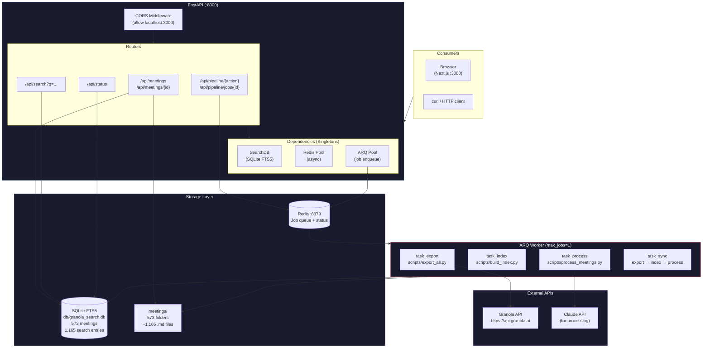
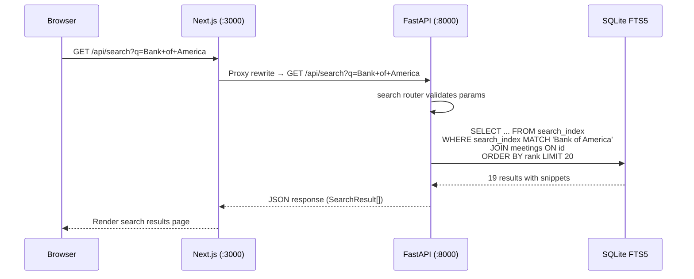
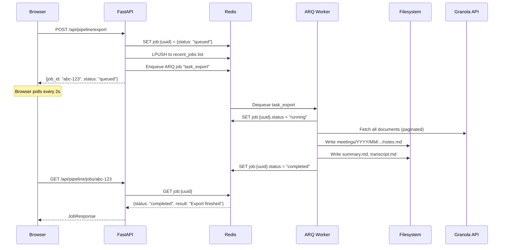
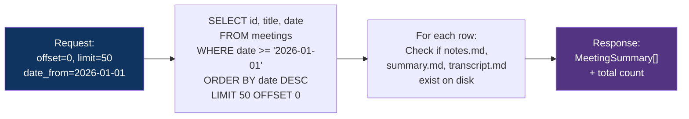
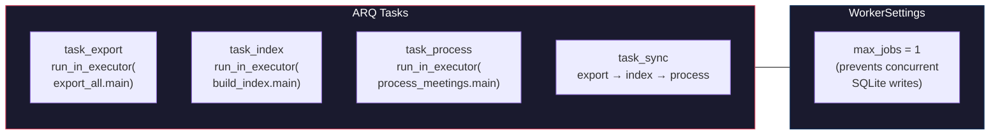
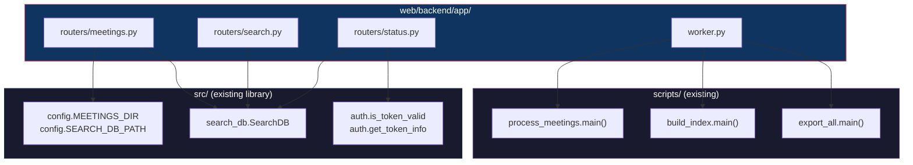

# Backend Architecture: FastAPI + ARQ + Redis

## The Problem It Solves

The CLI pipeline works perfectly — 586 meetings exported, 1,165 search entries indexed, all via terminal commands. But end users shouldn't need to `ssh` into a machine or open a terminal to search their meetings or trigger a re-export.

**Real scenario**: A user wants to search for "Bank of America duplication" across all meeting notes, summaries, and transcripts — then trigger a re-index because new meetings were recorded today. Without the backend, they'd need to run two separate terminal commands and wait. With the API, a single `GET /api/search?q=Bank+of+America` returns ranked results in milliseconds, and `POST /api/pipeline/index` queues the job asynchronously.

---

## Architecture Overview



---

## Request Flow: How a Search Query Travels



---

## Request Flow: How a Pipeline Job Runs



---

## File-by-File Breakdown

### `app/main.py` — Application Entry Point

Creates the FastAPI app with:
- **CORS middleware** allowing `localhost:3000`
- **Lifespan** handler that opens Redis on startup, closes on shutdown
- **4 routers** mounted under `/api` prefix

```python
# What it imports
from app.routers import meetings, search, pipeline, status

# What it configures
app.add_middleware(CORSMiddleware, allow_origins=["http://localhost:3000"])
app.include_router(meetings.router, prefix="/api")  # ... etc
```

### `app/schemas.py` — Pydantic Models

Every request and response is typed:

| Model | Fields | Used By |
|-------|--------|---------|
| `MeetingSummary` | id, title, date, has_notes, has_summary, has_transcript | `GET /api/meetings` |
| `MeetingDetail` | extends summary + notes_content, summary_content, transcript_content, attendees | `GET /api/meetings/{id}` |
| `SearchResult` | meeting_id, title, content_type, date, snippet | `GET /api/search` |
| `JobResponse` | job_id, status, action, created_at, result | `POST /api/pipeline/*` |
| `StatusResponse` | token_valid, token_remaining_seconds, db_stats, export_count | `GET /api/status` |
| `PipelineAction` | enum: export, index, process, sync | Path parameter |

### `app/dependencies.py` — Shared Singletons

Three singletons created once and reused across all requests:

```
get_redis()     → Redis connection for job metadata reads
get_arq_pool()  → ARQ pool for enqueuing jobs
get_search_db() → SearchDB instance wrapping SQLite FTS5
```

**Why singletons?** SQLite connections and Redis pools are expensive to create per-request. The SearchDB instance opens one SQLite connection in WAL mode for concurrent reads.

### `app/routers/meetings.py` — Meeting List & Detail

Two endpoints that combine **SQLite metadata** with **filesystem content**:

**`GET /api/meetings?offset=0&limit=50&date_from=2026-01-01`**



**`GET /api/meetings/{id}`** — Reads actual `.md` files from disk, parses YAML frontmatter, returns full content for notes, summary, and transcript.

**Real scenario**: `GET /api/meetings/456bd11d-40e9-4be4-bf3d-d698cec0b40c` returns:
- title: "Bank of America metrics duplication investigation with Alexis"
- summary_content: 1,560 chars of AI-generated summary
- transcript_content: 13,679 chars of full conversation transcript
- has_notes: false (no user notes for this meeting)

### `app/routers/search.py` — Full-Text Search

Thin wrapper around the existing `SearchDB.search()` method:

```python
@router.get("/api/search")
def search_meetings(q: str, type: str = None, date_from: str = None, ...):
    db = get_search_db()
    return db.search(query=q, content_type=type, date_from=date_from, ...)
```

**Real scenario**: `GET /api/search?q=dbt+airflow&type=summary`
- Searches only in summary content (not transcripts)
- Returns ranked results with FTS5 snippet highlighting (`**bold**` around matches)
- Porter stemming means "running" matches "run", "banking" matches "bank"

### `app/routers/pipeline.py` — Async Job Management

Three endpoints for managing long-running pipeline operations:

| Endpoint | What It Does |
|----------|--------------|
| `POST /api/pipeline/export` | Queues ARQ job to run `export_all.py` |
| `POST /api/pipeline/sync` | Queues: export → index → process (sequential) |
| `GET /api/pipeline/jobs/{id}` | Returns job status from Redis |
| `GET /api/pipeline/jobs` | Lists 20 most recent jobs |

**Why async?** Exporting 586 meetings takes ~1 minute (API rate limit), rebuilding the index takes ~5 seconds, processing with Claude takes minutes. These can't block an HTTP request.

### `app/routers/status.py` — Health & Diagnostics

**`GET /api/status`** returns everything a dashboard needs:

```json
{
  "token_valid": true,
  "token_remaining_seconds": 20794.865,
  "db_stats": {
    "meetings": 573,
    "notes": 40,
    "summaries": 556,
    "transcripts": 0,
    "search_index": 1165
  },
  "export_count": 586
}
```

### `app/worker.py` — ARQ Background Tasks

Runs as a separate process (`arq app.worker.WorkerSettings`). Consumes jobs from Redis and runs pipeline scripts:



**Why `max_jobs=1`?** SQLite doesn't handle concurrent writes well. Running export and index simultaneously could corrupt the database. Sequential execution is safer and simpler.

**Why `run_in_executor`?** The pipeline scripts use blocking I/O (file reads, HTTP requests). `run_in_executor` runs them in a thread pool so the async event loop isn't blocked.

---

## How the Backend Reuses Existing Code

The backend imports directly from `src/` and `scripts/` — zero duplication:



---

## API Reference: All Endpoints

| Method | Path | Description | Response |
|--------|------|-------------|----------|
| GET | `/api/meetings?offset=0&limit=50&date_from=&date_to=` | Paginated meeting list | `MeetingsListResponse` |
| GET | `/api/meetings/{id}` | Full meeting content (notes + summary + transcript) | `MeetingDetail` |
| GET | `/api/search?q=...&type=&date_from=&date_to=&limit=20` | Full-text search | `SearchResult[]` |
| GET | `/api/status` | Token, DB stats, export count | `StatusResponse` |
| POST | `/api/pipeline/{action}` | Trigger async job (export/index/process/sync) | `JobResponse` |
| GET | `/api/pipeline/jobs` | List 20 recent jobs | `JobResponse[]` |
| GET | `/api/pipeline/jobs/{id}` | Get single job status | `JobResponse` |

---

## Real Scenario: Full Sync Job

A user clicks "Full Sync" on the pipeline dashboard. Here's what happens:

1. **Browser** → `POST /api/pipeline/sync`
2. **FastAPI** creates job `abc-123` in Redis with status `queued`, enqueues ARQ task
3. **ARQ worker** picks up `task_sync`, updates status to `running`
4. **Step 1 — Export**: Calls Granola API, fetches any new meetings, writes to `meetings/YYYY/MM/`
5. **Step 2 — Index**: Walks `meetings/`, parses frontmatter, rebuilds FTS5 index
6. **Step 3 — Process**: Sends each meeting to Claude API, extracts action items and tags
7. **Worker** updates Redis: status `completed`, result "Full sync finished successfully"
8. **Browser** (polling every 2s) sees the status change and shows green "completed" badge

If the Granola token is expired (step 4 fails), the worker catches the exception, sets status to `failed` with the error message, and the browser shows a red "failed" badge.
