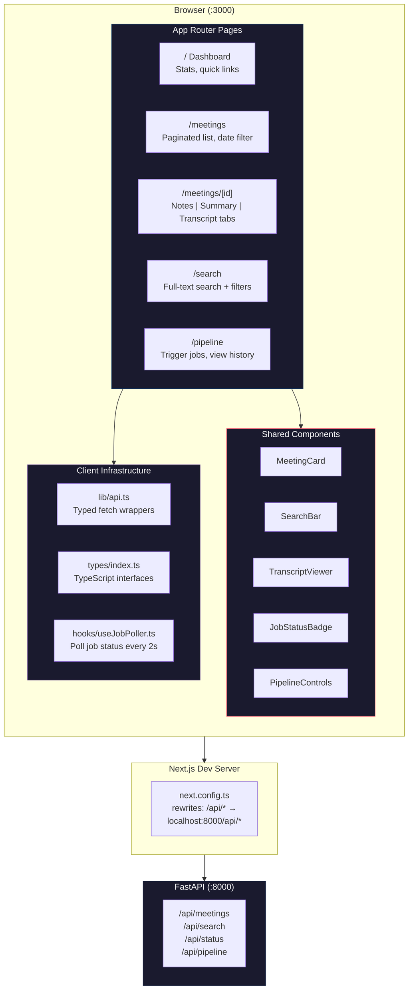
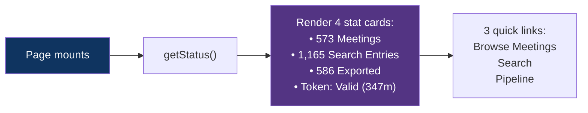
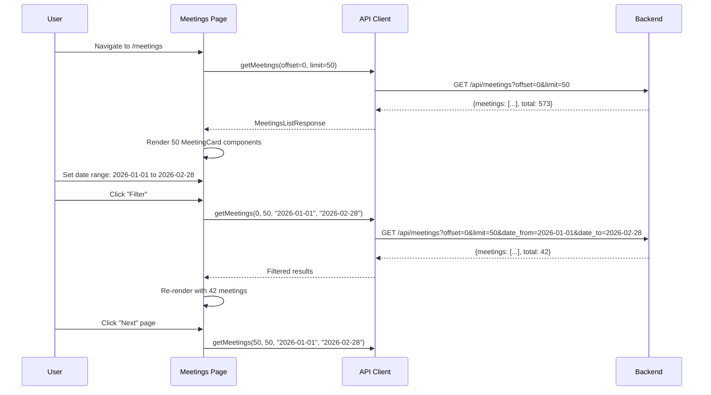
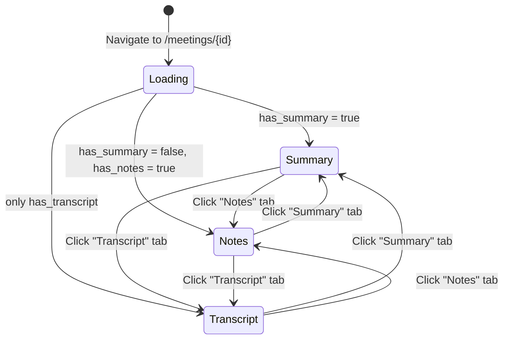
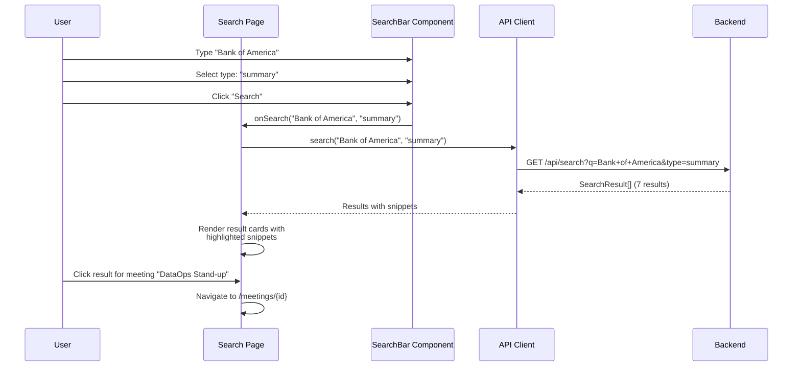
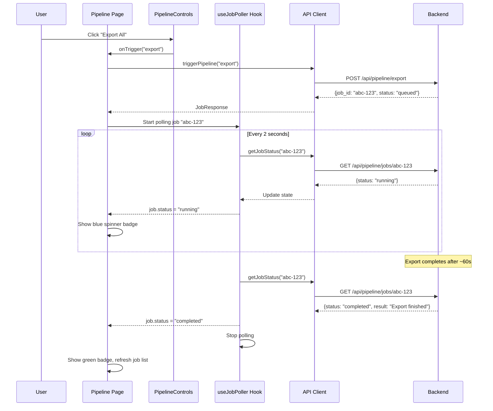
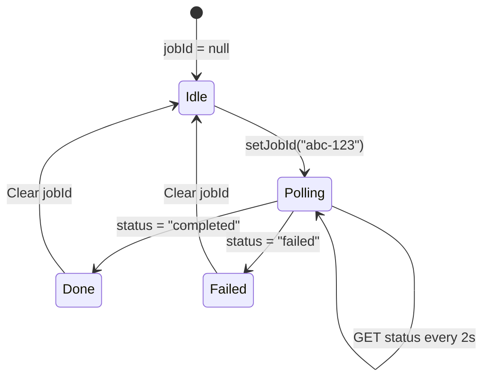
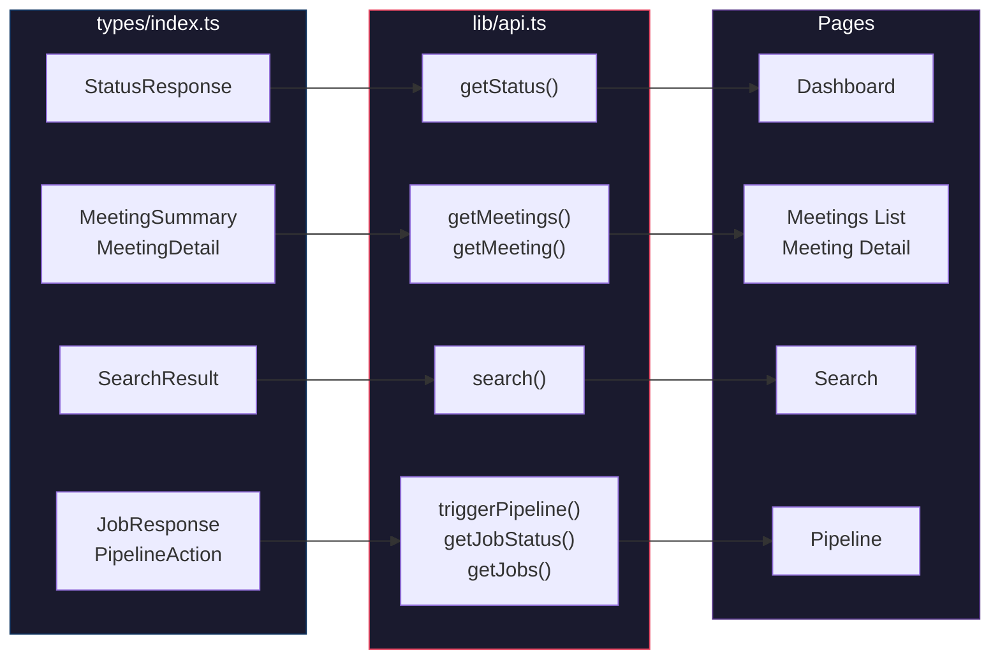
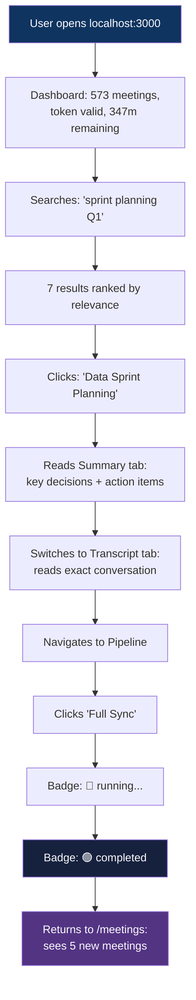

# Frontend Architecture: Next.js + Tailwind CSS

## The Problem It Solves

The FastAPI backend exposes 7 API endpoints, but JSON responses in a terminal aren't user-friendly. Users need a visual interface to browse 573 meetings, search with instant results, read transcripts with speaker colors, and trigger pipeline jobs with one click.

**Real scenario**: A user wants to find what was decided in the "Bank of America metrics duplication" meeting, read the full transcript, and then trigger a re-export because new meetings happened today. Without the frontend, that's three terminal commands. With the UI: search → click meeting → read transcript tab → click "Export All" button.

---

## Architecture Overview



---

## Page-by-Page Breakdown

### Dashboard (`/`) — `app/page.tsx`

Shows at-a-glance stats and navigation:



**Real scenario**: User opens `localhost:3000` and immediately sees that the token expires in 347 minutes — plenty of time to run a full sync. They also see 573 meetings are indexed. They click "Search" to find a specific discussion.

---

### Meetings List (`/meetings`) — `app/meetings/page.tsx`

Paginated grid of all meetings with date filtering:



Each meeting renders as a `MeetingCard` with:
- **Title** (truncated if too long)
- **Date** (e.g., "2026-02-19")
- **Content badges**: Notes (blue if exists, gray if not), Summary, Transcript

**Real scenario**: User filters to January 2026, sees 38 meetings. Each card shows that most have Summary + Transcript but only a few have Notes (because the user didn't write notes for every meeting).

---

### Meeting Detail (`/meetings/[id]`) — `app/meetings/[id]/page.tsx`

Tabbed view of a single meeting's full content:



**Tab rendering**:
- **Notes tab** — Raw markdown (whitespace-preserved)
- **Summary tab** — AI-generated summary (whitespace-preserved)
- **Transcript tab** — Uses `TranscriptViewer` component with speaker colors

**Real scenario**: User clicks on "Bank of America metrics duplication investigation with Alexis" from the meetings list. The detail page loads with:
- Summary tab active (default): Shows key decisions and action items in markdown
- Transcript tab: 13,679 characters of conversation, with "You" in blue and "Other" in gray
- Notes tab: Disabled (grayed out) because no user notes exist for this meeting

---

### Search (`/search`) — `app/search/page.tsx`

Full-text search with type filtering and date range:



**Snippet rendering**: The backend returns `**Bank**` markers around matches. The frontend converts these to `<mark>` tags with yellow highlighting:

```
Input:  "...Alexis **Bank** and Gamebridge are UAT ready..."
Output: "...Alexis <mark>Bank</mark> and Gamebridge are UAT ready..."
```

**Real scenario**: User searches for `"dbt airflow"` (with quotes for phrase match), filters to summaries only. Gets 12 results showing key decisions about their dbt/Airflow pipeline, not raw transcript chatter.

---

### Pipeline (`/pipeline`) — `app/pipeline/page.tsx`

Dashboard for triggering and monitoring async pipeline jobs:



**Button states**: All 4 pipeline buttons are disabled while a job is running (`max_jobs=1` on the worker means only one can run at a time).

**Real scenario**: User clicks "Full Sync" after recording 5 new meetings today. The button group disables, a blue "running" badge appears with a spinner. After ~90 seconds (export + index + process), the badge turns green. The user navigates to /meetings to see their new meetings in the list.

---

## Component Details

### `MeetingCard.tsx`

Renders a single meeting in the list grid:

```
┌──────────────────────────────────┐
│ Bank of America metrics dupl...  │
│ 2026-02-19                       │
│                                  │
│ [Notes] [Summary] [Transcript]   │
│  gray    blue      blue          │
└──────────────────────────────────┘
```

- Blue badges = content exists on disk
- Gray badges = no file found
- Entire card is a link to `/meetings/{id}`

### `SearchBar.tsx`

Search form with three filter controls:

```
┌─────────────────────────────┬──────────┐
│ Search meetings...          │ [Search] │
└─────────────────────────────┴──────────┘
[All types ▼]  [From: ____]  [To: ____]
```

- Dropdown filters: All types, Notes, Summary, Transcript
- Date range pickers for temporal filtering
- Submit triggers the `onSearch` callback

### `TranscriptViewer.tsx`

Parses transcript markdown and renders with speaker colors:

```
00:12:34  You    What is the plan for the Bank of America fix?
00:12:45  Other  We need to check the attribution keys first.
00:12:52  You    Can you pull the source table data?
00:13:01  Other  Yes, I'll compare sill table vs final view.
```

- Parses `**[HH:MM:SS] Speaker:** text` format from markdown
- "You" = blue (`text-blue-600`)
- "Other" = gray (`text-gray-500`)
- Timestamps in monospace tabular numerals
- Falls back to raw `<pre>` if parsing fails

### `JobStatusBadge.tsx`

Colored status indicator:

| Status | Color | Extra |
|--------|-------|-------|
| queued | Yellow `bg-yellow-100` | — |
| running | Blue `bg-blue-100` | Spinning border animation |
| completed | Green `bg-green-100` | — |
| failed | Red `bg-red-100` | — |

### `PipelineControls.tsx`

2x2 button grid:

```
┌─────────────────────┬─────────────────────────┐
│ Export All           │ Rebuild Index            │
│ Fetch from Granola   │ Rebuild SQLite FTS5      │
├─────────────────────┼─────────────────────────┤
│ Process with Claude  │ Full Sync                │
│ Extract intelligence │ Export + Index + Process  │
└─────────────────────┴─────────────────────────┘
```

All buttons disabled while any job is running.

---

## `useJobPoller` Hook — Polling Pattern



**Key behaviors**:
- Starts polling immediately when `jobId` is set
- Polls `GET /api/pipeline/jobs/{id}` every 2 seconds
- Automatically stops when status is terminal (`completed` or `failed`)
- Cleans up interval on unmount (prevents memory leaks)

---

## Data Flow: Types → API → Components



The TypeScript interfaces in `types/index.ts` mirror the Pydantic models in `app/schemas.py` exactly — same field names, same types. This ensures type safety from database to browser.

---

## Next.js Configuration

### API Proxy (`next.config.ts`)

```typescript
async rewrites() {
  return [{ source: '/api/:path*', destination: 'http://localhost:8000/api/:path*' }];
}
```

**Why proxy?** The frontend runs on `:3000`, the backend on `:8000`. Without the proxy, every fetch call would need `http://localhost:8000` and CORS would block cross-origin requests from the browser. The rewrite makes all API calls same-origin.

### Tailwind CSS v4 (`globals.css`)

```css
@import "tailwindcss";
@source "..";
```

The `@source ".."` directive tells Tailwind v4 to scan `src/` (one level up from `src/app/globals.css`) for utility classes used in components, hooks, and pages.

---

## Real Scenario: User's Daily Workflow


