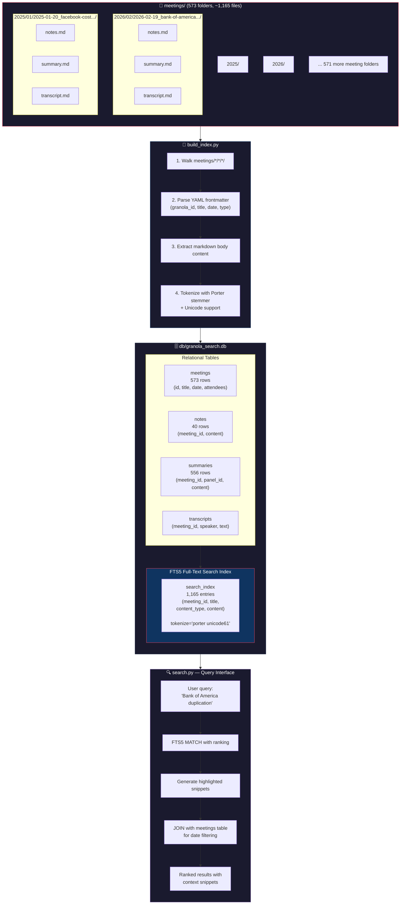
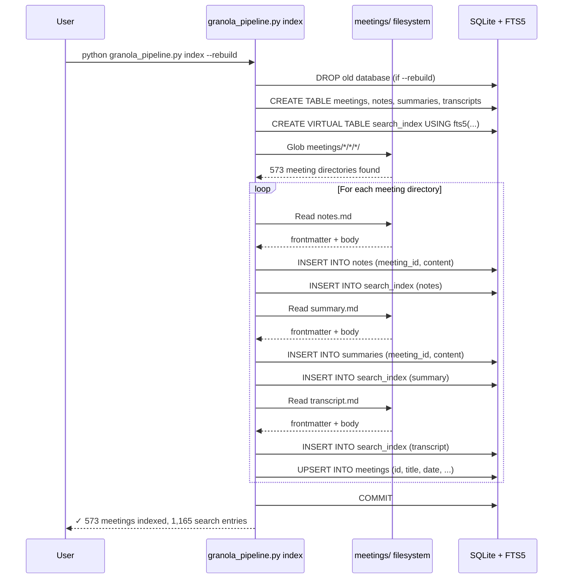

# How `python granola_pipeline.py index` Works

## The Problem It Solves

You have **573 meeting folders** with ~1,165 markdown files spread across `meetings/2025/` and `meetings/2026/`. Without an index, finding information means manually opening files or running slow `grep` across thousands of files.

**Real scenario**: "In which meeting did we discuss the Bank of America duplication issue, and what did the team decide?" — You'd need to open and read through hundreds of files. With the index, it's instant:

```bash
python granola_pipeline.py search "Bank of America duplication"
# → Returns 19 results in <0.1 seconds, ranked by relevance
```

---

## Architecture Diagram



---

## What Happens Step by Step



---

## Real Scenario Examples

### Scenario 1: "What did we decide about the Bank of America issue?"

```bash
python granola_pipeline.py search "Bank of America duplication"
```

**What happens internally:**
```sql
SELECT meeting_id, title, content_type,
       snippet(search_index, 3, '**', '**', '...', 40) as snippet
FROM search_index
JOIN meetings ON meetings.id = search_index.meeting_id
WHERE search_index MATCH 'Bank of America duplication'
ORDER BY rank
LIMIT 20;
```

**Result**: 19 matches across summaries AND transcripts — you see the exact context where the issue was discussed, who said what, and what the decisions were.

---

### Scenario 2: "Find all dbt/Airflow discussions in summaries only"

```bash
python granola_pipeline.py search --type summary "dbt airflow"
```

**Why filter by type?** Transcripts contain every word spoken (including filler words). Summaries are AI-distilled — searching summaries gives you the key decisions and outcomes, not the raw conversation.

---

### Scenario 3: "What interviews happened in April-May 2025?"

```bash
python granola_pipeline.py search --date-from 2025-04-01 --date-to 2025-05-31 "interview"
```

**What the date filter does internally:**
```sql
WHERE search_index MATCH 'interview'
  AND meetings.date >= '2025-04-01'
  AND meetings.date <= '2025-05-31'
```

---

### Scenario 4: "Find everywhere Snowflake was mentioned in transcripts"

```bash
python granola_pipeline.py search --type transcript "Snowflake"
```

**Why this matters**: The transcript captures exact words spoken by real people. You can find moments where a colleague recommended Snowflake, reported a Snowflake issue, or discussed migration plans — with speaker attribution and timestamps.

---

## Why FTS5 (Not Just grep)?

| Feature | `grep -r "query" meetings/` | FTS5 Index |
|---------|---------------------------|------------|
| Speed on 1,165 files | ~2-5 seconds | **<0.01 seconds** |
| Ranked results | No (alphabetical) | **Yes (relevance score)** |
| Stemming ("running" → "run") | No | **Yes (Porter stemmer)** |
| Phrase search `"sprint review"` | Manual regex | **Built-in** |
| Boolean `dbt AND NOT airflow` | Complex regex | **Built-in** |
| Highlighted snippets | No | **Yes (40-word context)** |
| Filter by date range | Manual | **SQL WHERE clause** |
| Filter by content type | Separate dirs | **content_type column** |

---

## Database Stats After Index Build

| Table | Rows | What It Contains |
|-------|------|-----------------|
| `meetings` | 573 | One row per meeting (id, title, date, attendees) |
| `notes` | 40 | User-written notes (only 40 meetings had notes) |
| `summaries` | 556 | AI-generated meeting summaries |
| `transcripts` | 0 | Individual entries (populated if needed) |
| `search_index` | 1,165 | FTS5 virtual table — every piece of content indexed |

The 1,165 search entries = 573 meetings × ~2 files each (summary + transcript, some with notes too).
